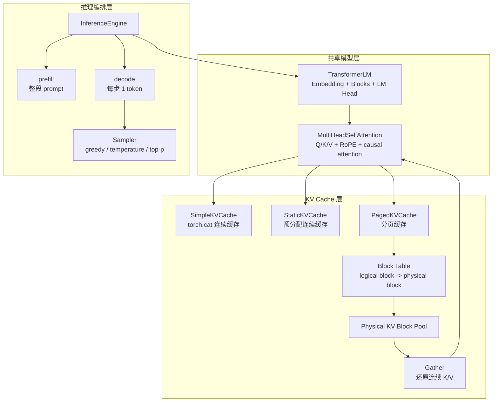
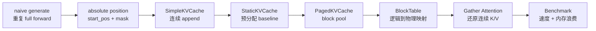

# MiniLLM PagedAttention 实现指南

这份文档是 `mini-llm` 推理引擎的最终学习与实现路线。目标不是复刻 vLLM 的生产级 CUDA PagedAttention kernel，而是在当前 from-scratch Transformer 项目里，用纯 Python / PyTorch 实现一个能讲清楚、能测试、能 benchmark 的 simplified PagedAttention。

核心主线：

```text
naive generation
  -> simple KV cache
  -> prefill / decode
  -> static KV cache baseline
  -> paged KV cache
  -> block table
  -> gather attention
  -> benchmark 对比
```

一句话定位：

```text
这是 simplified paged KV cache + gather attention，不是 CUDA kernel 级 PagedAttention。
```

---

## 1. 你最终要实现什么

最终系统由三层组成：

```text
TransformerLM
  负责共享权重和 attention/FFN 计算

InferenceEngine
  负责 prefill、decode、sampling、request 状态

KVCache / PagedKVCache
  负责保存、追加、释放、gather 历史 K/V
```

不要把训练模型和推理模型复制成两套。更稳的做法是：

```text
一个 TransformerLM
  - 训练时：无 cache full forward
  - 推理时：显式传入 cache 和 start_pos
```

`InferenceEngine` 是推理流程控制器，`KVCache` 是状态容器，`TransformerLM` 是计算图。

---

## 2. 整体架构图



---

## 3. 为什么 naive generation 慢

当前 naive generation 的行为是：

```text
prompt = [x1, x2, x3]

step 1:
  forward([x1, x2, x3]) -> y1

step 2:
  forward([x1, x2, x3, y1]) -> y2

step 3:
  forward([x1, x2, x3, y1, y2]) -> y3
```

问题在于：旧 token 的 K/V 每一步都被重新计算。

KV cache 的行为是：

```text
prefill:
  forward([x1, x2, x3])
  保存每一层的 K/V

step 1 decode:
  forward([y1])
  只计算 y1 的新 K/V
  attention 时读取历史 K/V

step 2 decode:
  forward([y2])
  只计算 y2 的新 K/V
  attention 时读取历史 K/V
```

所以 KV cache 解决的是重复计算问题。

---

## 4. 当前模型必须先补齐的两个概念

### 4.1 RoPE 必须使用绝对位置

full forward 时：

```text
input length = 5
positions = [0, 1, 2, 3, 4]
```

decode 时每次只输入 1 个 token。如果局部写法还是：

```text
positions = [0]
```

那么第 100 个 token 会被当成第 0 个 token，输出会错。

正确概念是：

```text
start_pos = 当前输入片段在完整序列里的起始位置
positions = start_pos + arange(T_new)
```

例子：

```text
prefill prompt length = 4
positions = [0, 1, 2, 3]

decode next token
start_pos = 4
positions = [4]
```

### 4.2 causal mask 应该基于绝对位置

full forward：

```text
q_positions  = [0, 1, 2, 3]
kv_positions = [0, 1, 2, 3]
```

mask：

```text
[[1, 0, 0, 0],
 [1, 1, 0, 0],
 [1, 1, 1, 0],
 [1, 1, 1, 1]]
```

decode 单 token：

```text
q_positions  = [4]
kv_positions = [0, 1, 2, 3, 4]
```

mask：

```text
[[1, 1, 1, 1, 1]]
```

通用规则：

```text
mask[q_i, kv_j] = q_abs_pos[i] >= kv_abs_pos[j]
```

这个规则可以同时覆盖：

```text
full forward
prefill
decode
chunked prefill
```

---

## 5. 阶段一：SimpleKVCache

先不要分页。第一步只实现最普通的连续 KV cache。

### 5.1 数据结构

每一层保存一份 K/V：

```text
LayerKVCache
  k: [B, H, T_cache, D_head]
  v: [B, H, T_cache, D_head]
  length: int
```

整个模型保存多层 cache：

```text
ModelKVCache
  layers: list[LayerKVCache]
```

### 5.2 append 的状态演变

第一次 append：

```text
k_new: [B, H, 3, D]
cache.k = k_new
length = 3
```

第二次 append：

```text
k_new: [B, H, 2, D]
cache.k = cat([old_k, k_new], dim=2)
length = 5
```

返回给 attention 的是：

```text
k_all: [B, H, T_cache + T_new, D]
v_all: [B, H, T_cache + T_new, D]
```

### 5.3 attention 的数据流

```text
x_new
  -> q_new / k_new / v_new
  -> RoPE(q_new, absolute positions)
  -> RoPE(k_new, absolute positions)
  -> cache.append(k_new, v_new)
  -> k_all / v_all
  -> q_new attend k_all / v_all
```

注意：decode 时 `q_new` 只有当前 token，但 `k_all/v_all` 包含完整历史。

### 5.4 验收标准

必须先证明这几件事：

```text
LayerKVCache append == 手动 torch.cat
full forward 最后一个 token logits ~= cached decode logits
naive greedy generation == cached greedy generation
```

如果不一致，优先检查：

```text
start_pos 是否错一位
RoPE 是否同时作用在 q 和 k
causal mask 是否错误屏蔽历史 token
cache 是否重复 append 了 prompt
```

---

## 6. 阶段二：StaticKVCache baseline

`torch.cat` 版本正确后，建议做一个预分配版本作为 baseline。

### 6.1 数据结构

```text
k_buffer: [B, H, max_seq_len, D_head]
v_buffer: [B, H, max_seq_len, D_head]
length: int
```

### 6.2 append 的状态演变

```text
append(k_new, v_new, start_pos)

写入范围：
[start_pos : start_pos + T_new]

length = max(length, start_pos + T_new)
```

返回：

```text
k_all = k_buffer[:, :, :length, :]
v_all = v_buffer[:, :, :length, :]
```

### 6.3 为什么它重要

Static cache 的缺点是浪费：

```text
每个 sequence 都预留 max_seq_len
即使实际只生成了很短，也占着完整空间
```

Paged cache 的价值不是第一版速度一定更快，而是内存利用率更好。

---

## 7. 阶段三：理解 PagedKVCache

PagedKVCache 类似虚拟内存。

```text
sequence token positions
  -> logical blocks
  -> block table
  -> physical KV blocks
```

### 7.1 一个具体例子

假设：

```text
block_size = 4
seq_id = 0
seq length = 10
```

逻辑 token：

```text
0 1 2 3 | 4 5 6 7 | 8 9
```

逻辑 block：

```text
block 0 | block 1 | block 2
```

block table：

```text
block_table[0] = [7, 2, 11]
```

含义：

```text
seq 0 logical block 0 -> physical block 7
seq 0 logical block 1 -> physical block 2
seq 0 logical block 2 -> physical block 11
```

物理 block 不需要连续。逻辑顺序由 block table 维护。

### 7.2 核心状态

教学版建议先用 Python list/dict 管状态：

```text
block_size: int
num_blocks: int
num_heads: int
head_dim: int

k_pool: [num_blocks, block_size, H, D]
v_pool: [num_blocks, block_size, H, D]

block_tables: dict[seq_id, list[physical_block_id]]
seq_lengths: dict[seq_id, int]
free_blocks: list[int]
```

如果未来接多层模型，可以有两种组织方式：

```text
方案 A：每层一个 PagedKVCache
  清楚，最适合第一版

方案 B：一个 cache 里带 num_layers 维度
  更集中，但状态管理更复杂
```

建议第一版选方案 A。

---

## 8. PagedKVCache 的四个核心动作

### 8.1 allocate

当某个 sequence 需要新 block 时：

```text
free_blocks 弹出一个 physical_block_id
加入 block_tables[seq_id]
```

状态变化：

```text
before:
  free_blocks = [5, 6, 7]
  block_tables[0] = [2]

after allocate:
  free_blocks = [5, 6]
  block_tables[0] = [2, 7]
```

### 8.2 append

append 的任务是把新 token 的 K/V 写进正确的 physical block 和 offset。

关键映射：

```text
old_len = seq_lengths[seq_id]
logical_pos = old_len + i
logical_block = logical_pos // block_size
offset = logical_pos % block_size
physical_block = block_tables[seq_id][logical_block]
```

如果 `logical_block` 不存在，就先 allocate 一个新 physical block。

### 8.3 gather

gather 的任务是按逻辑顺序把分散的物理 block 还原成连续 K/V。

```text
block_table[0] = [7, 2, 11]
seq_len = 10
block_size = 4
```

读取顺序：

```text
physical block 7: offset 0..3
physical block 2: offset 0..3
physical block 11: offset 0..1
```

输出：

```text
k_all: [H, T_seq, D]
v_all: [H, T_seq, D]
```

最后一个 block 的 padding 必须裁掉，只保留 `seq_len` 个 token。

### 8.4 free

sequence 结束后释放它占用的 physical blocks。

```text
freed = block_tables[seq_id]
free_blocks.extend(freed)
del block_tables[seq_id]
del seq_lengths[seq_id]
```

必须保证：

```text
free 后 block 数量恢复
free 后 block 可以被新 sequence 复用
free 后旧 seq_id 不应该还能 gather
```

---

## 9. 阶段四：Paged Gather Attention

第一版不要写 kernel，也不要直接追 FlexAttention。

推荐路径：

```text
PagedKVCache.gather(seq_id)
  -> k_all: [H, T, D]
  -> v_all: [H, T, D]
  -> unsqueeze batch
  -> [1, H, T, D]
  -> 复用现有 scaled_dot_product_attention
```

接模型时先只支持 batch size 1，流程最清楚：

```text
模型产生：
  k_new: [1, H, T_new, D]
  v_new: [1, H, T_new, D]

cache 内部：
  squeeze batch -> [H, T_new, D]
  append(seq_id, k_new, v_new)
  gather(seq_id) -> [H, T_all, D]

attention 使用：
  unsqueeze batch -> [1, H, T_all, D]
```

这一步的验收标准：

```text
simple cache attention 输出 ~= paged gather attention 输出
```

---

## 10. 推理流程：prefill / decode

### 10.1 prefill

输入：

```text
prompt: [B, T_prompt]
start_pos = 0
use_cache = True
```

行为：

```text
每层计算 prompt 的 K/V
append 到 cache
返回最后一个 token 的 logits
```

### 10.2 decode

输入：

```text
last_token: [B, 1]
start_pos = 当前完整序列长度
use_cache = True
```

行为：

```text
每层只计算 last_token 的新 K/V
append 到 cache
读取全部历史 K/V
返回当前 token 的 logits
```

### 10.3 generate

整体状态演变：

```text
state.input_ids = prompt
state.generated_ids = []
state.current_pos = prompt_length
state.finished = False

prefill(prompt)
while not finished:
  next_token = sample(logits)
  append next_token to generated_ids
  decode(next_token, start_pos=current_pos)
  current_pos += 1
```

---

## 11. 建议文件边界

```text
cs336_basics/model.py
  TransformerLM / TransformerBlock / MultiHeadSelfAttention
  支持 start_pos 和可选 cache
  默认训练行为不变

cs336_basics/kv_cache.py
  LayerKVCache
  ModelKVCache
  StaticKVCache
  PagedKVCache

cs336_basics/inference.py
  InferenceEngine
  RequestState
  SamplingConfig
  Sampler

scripts/bench_inference.py
  naive / simple / static / paged 对比
```

模型层不要负责：

```text
request 调度
block 分配策略
benchmark
复杂 sampling 配置
```

cache 层不要负责：

```text
tokenizer
采样
生成停止条件
loss
optimizer
```

---

## 12. 推荐实现顺序

### Milestone A：先修正位置和 mask

目标：让模型能表达“当前片段从完整序列第几个位置开始”。

Checklist：

```text
实现 absolute positions
实现 absolute causal mask
full forward 默认行为保持不变
```

验收：

```text
full mask 等于下三角
decode 单 token 可以看见所有历史
chunked prefill mask 符合预期
```

### Milestone B：SimpleKVCache 正确

Checklist：

```text
LayerKVCache append/get/reset
ModelKVCache 管理每层 cache
attention 接入 cache
TransformerLM 接入 cache
```

验收：

```text
append 两次等于手动 cat
cached decode 等价 full forward 最后一个 token
greedy cached generation 等价 naive greedy generation
```

### Milestone C：StaticKVCache baseline

Checklist：

```text
预分配 k_buffer/v_buffer
按 start_pos 写入
防止越界
防止跳写 gap
```

验收：

```text
static cache 输出等价 simple cache
static allocated tokens 可统计
```

### Milestone D：PagedKVCache standalone

Checklist：

```text
block pool
free_blocks
block_tables
seq_lengths
append
gather
free_sequence
memory_stats
```

验收：

```text
单 sequence 单 block 正确
单 sequence 跨 block 正确
逐 token append 和整段 append 等价
多 sequence 不串数据
free 后 block 数量恢复
free 后 block 可复用
物理 block 不够时报错
```

### Milestone E：Paged cache 接 attention

Checklist：

```text
batch size 1 路径
每层 cache
append 新 K/V
gather 全历史 K/V
复用普通 attention
```

验收：

```text
paged cache attention 等价 simple cache attention
paged greedy generation 等价 naive greedy generation
```

### Milestone F：benchmark 和记录

Checklist：

```text
naive generate
simple cache torch.cat
static cache
paged cache gather
```

指标：

```text
tokens_per_second
latency_ms_per_token
peak_memory_mb
allocated_tokens
actual_tokens
waste_ratio
```

---

## 13. 测试路线图

测试应该从小到大，不要一开始就测整模型。

```text
Lab 0: position + mask
Lab 1: LayerKVCache
Lab 2: StaticKVCache
Lab 3: PagedKVCache allocator
Lab 4: attention cache equivalence
Lab 5: TransformerBlock / TransformerLM equivalence
Lab 6: generation equivalence
Lab 7: memory accounting
```

### Lab 0：position + mask

```text
q_positions = [0, 1, 2, 3]
kv_positions = [0, 1, 2, 3]
期望：下三角
```

```text
q_positions = [4]
kv_positions = [0, 1, 2, 3, 4]
期望：[[1, 1, 1, 1, 1]]
```

```text
q_positions = [3, 4]
kv_positions = [0, 1, 2, 3, 4]
期望：
[[1, 1, 1, 1, 0],
 [1, 1, 1, 1, 1]]
```

### Lab 1：LayerKVCache

```text
首次 append 后 length 正确
连续两次 append 等于 torch.cat
reset 后状态为空
shape 不匹配时报错
```

### Lab 2：StaticKVCache

```text
从 0 写入正确
从非 0 位置追加正确
超过 max_seq_len 报错
不允许跳写 gap
```

### Lab 3：PagedKVCache

```text
单 block 写入正确
跨 block 写入正确
逐 token append == 整段 append
多 sequence 互不影响
free 后 block 恢复
free 后 block 可复用
block 不够时报错
超过单 sequence 最大长度时报错
```

### Lab 4：attention 等价性

```text
无 RoPE cached attention == full attention 最后 token
带 RoPE cached attention == full attention 最后 token
paged cache attention == simple cache attention
```

### Lab 5：模型级等价性

```text
TransformerBlock cached decode == full forward 最后 token
TransformerLM cached logits == full forward 最后 token
```

### Lab 6：生成级等价性

只用 greedy，不用随机采样。

```text
simple cache greedy == naive greedy
static cache greedy == naive greedy
paged cache greedy == naive greedy
```

### Lab 7：memory accounting

```text
static_allocated_tokens = num_sequences * max_seq_len
paged_allocated_tokens = sum(ceil(seq_len / block_size) * block_size)
actual_tokens = sum(seq_len)
```

```text
static_waste = 1 - actual_tokens / static_allocated_tokens
paged_waste = 1 - actual_tokens / paged_allocated_tokens
```

---

## 14. benchmark 应该怎么解释

最小对比：

```text
naive generate
simple cache torch.cat
static cache
paged cache gather
```

速度预期：

```text
naive 在长 context 下最慢
simple torch.cat 可能因为反复拼接不稳定
static cache 通常比 torch.cat 更合理
paged gather 不一定比 static 快，因为 gather 有额外拷贝
```

所以第一版 paged gather 的卖点不要写成“速度一定更快”。更准确的描述是：

```text
用 block table 管理变长 sequence 的 KV cache，减少 static cache 的预分配浪费，并用 gather attention 验证 paged cache 语义正确。
```

内存 workload 建议：

```text
short: 16-256
mixed: 16-max_seq_len
long: max_seq_len/2 到 max_seq_len
```

预期：

```text
short workload 下 static 浪费严重，paged 优势明显
mixed workload 下 paged 更适合变长请求
long workload 下 paged 优势变小
```

---

## 15. 最常见 bug 清单

### 15.1 RoPE start_pos 错

现象：

```text
cached decode 和 full forward 不一致
越往后生成差异越大
```

检查：

```text
decode 第 n 个 token 的 position 是否真的是 n
q 和 k 是否都用了绝对位置
```

### 15.2 cache 重复 append

现象：

```text
cache length 比预期长
attention 的 kv length 不对
```

检查：

```text
prefill 是否只 append 一次 prompt
decode 是否只 append 新 token
```

### 15.3 mask 只按局部 T 构造

现象：

```text
decode token 只能看见自己，不能看见历史
```

检查：

```text
mask 是否使用 q_abs_pos 和 kv_abs_pos
```

### 15.4 gather 维度转置错

推荐统一约定：

```text
模型 attention: [B, H, T, D]
paged 内部: [H, T, D]
pool 单个 token: [H, D]
```

### 15.5 最后一个 block padding 没裁掉

现象：

```text
attention 看到未写入的 padding token
输出和 simple cache 不一致
```

检查：

```text
gather 输出是否裁剪到 seq_lengths[seq_id]
```

### 15.6 free 后状态没清空

现象：

```text
旧 seq_id 还能 gather
新 sequence 读到旧数据
free block 数量不恢复
```

检查：

```text
block_tables 是否删除
seq_lengths 是否删除
free_blocks 是否恢复
```

---

## 16. 最终你可以怎么描述这个项目

准确描述：

```text
基于自研 decoder-only TransformerLM 实现 KV cache 增量解码，将生成流程拆分为 prefill/decode 两阶段，复用各层历史 Key/Value。
```

```text
实现教学型 PagedKVCache，用 block table 管理逻辑 token block 到物理 KV block 的映射，并通过 gather attention 验证 paged cache 与连续 cache 的语义等价。
```

```text
构建 naive、simple cache、static cache、paged gather 的 benchmark，对比 tokens/sec、latency 和变长请求下的 KV cache memory waste。
```

避免这样写：

```text
实现了生产级 vLLM PagedAttention
实现了 CUDA PagedAttention kernel
PagedAttention 一定带来速度提升
```

---

## 17. 最终主线图



按这条线做，不要一开始引入 GQA、MQA、INT8、FlashAttention、prefix cache。那些都可以作为第二阶段扩展；第一阶段的核心是把 KV cache 和 paged block table 的语义做正确。