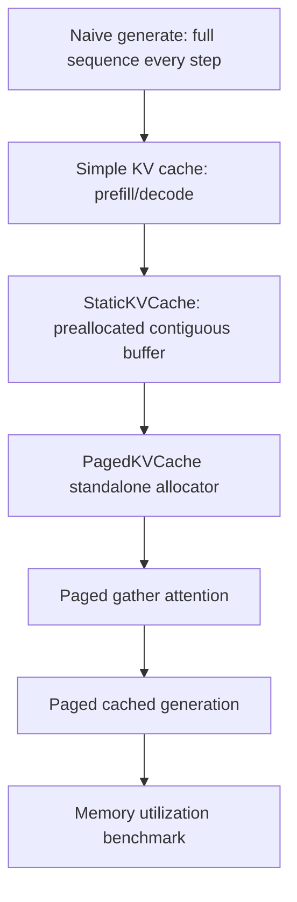

# MiniLLM PagedAttention 自实现计划

目标：在当前 `mini-llm` 项目里，用尽量纯 Python / PyTorch 的方式实现一个教学型推理 cache 系统。

最终主线不是直接做生产级 vLLM PagedAttention kernel，而是：

1. 先实现普通 KV cache，跑通 prefill / decode，证明 cached generation 和 naive generation 等价。
2. 再把普通 contiguous KV cache 换成 paged KV cache，用 block table 管理物理 KV blocks。
3. attention 阶段先用 gather 把 paged KV 还原成连续 K/V，再调用现有手写 attention 或 PyTorch SDPA。

一句话定位：

> 这是 simplified paged KV cache + gather attention，不是 CUDA kernel 级 PagedAttention。

## 结论：选哪个方案

Grok 给的两个方向里，建议选“Naive Gather 版本”作为主线，FlexAttention 只作为第三阶段可选项。

原因：

- Naive Gather 版本最适合你现在的目标：清楚、能手写、能 debug、能解释 block table。
- 当前项目的 `MultiHeadSelfAttention` 还没有 KV cache、`start_pos`、attention backend、batch inference scheduler。直接跳 FlexAttention 会把 PyTorch 新 API、BlockMask、page table 转换和模型改造混在一起。
- 你要展示的核心不是 kernel 性能，而是理解并实现 `logical token positions -> logical blocks -> physical KV blocks` 这条链路。
- 纯 Python gather 版速度未必快，但它足够证明内存管理思想，并能和 static KV cache 做内存浪费对比。

推荐版本：

```text
Phase 1: SimpleKVCache
  contiguous cache, torch.cat 或预分配，先证明 prefill/decode 正确

Phase 2: PagedKVCache
  block pool + block table + gather，先证明 allocator 正确

Phase 3: Paged attention integration
  用 PagedKVCache.gather(seq_id) 得到连续 K/V，再复用普通 attention

Phase 4: Optional
  SDPA backend、multi-request demo、prefix sharing、FlexAttention
```

## 当前代码要注意什么

主要文件：

```text
mini-llm/cs336_basics/model.py
```

当前 attention 形状：

```python
x: [B, T, D_model]
q/k/v after projection and reshape: [B, H, T, D_head]
attention output: [B, H, T, D_head]
```

当前 `MultiHeadSelfAttention.forward` 的关键问题：

```python
token_positions = torch.arange(0, s, device=x.device)
```

这在整段 forward 时没问题，但 decode 阶段每次只输入 1 个 token。如果仍然从 0 开始做 RoPE，那么第 100 个 token 会被当成第 0 个 token，输出必错。

所以第一阶段 KV cache 必须顺手改出这个能力：

```text
start_pos: 当前输入片段在完整序列里的起始位置
token_positions = start_pos + torch.arange(T)
```

另一个关键问题是 causal mask。

普通 full forward：

```text
q positions:  0 1 2 ... T-1
kv positions: 0 1 2 ... T-1
mask: q_pos >= kv_pos
```

decode forward：

```text
q positions:  [current_pos]
kv positions: [0, 1, 2, ..., current_pos]
mask 全 True
```

更通用的写法是基于绝对位置构造 mask：

```text
mask[q_i, kv_j] = q_abs_pos[i] >= kv_abs_pos[j]
```

这样 prefill、chunked prefill、decode 都能共用。

## 建议文件结构

新增：

```text
mini-llm/cs336_basics/kv_cache.py
mini-llm/cs336_basics/inference.py
mini-llm/tests/test_kv_cache_inference.py
mini-llm/tests/test_paged_kv_cache.py
```

可选新增：

```text
mini-llm/scripts/bench_kv_cache.py
mini-llm/scripts/bench_paged_kv_cache.py
portfolio/results/minillm-inference/metrics.md
```

## Phase 1：普通 KV cache

### 目标

先不做分页。只做最简单的 cache：

```text
每层保存过去所有 K/V
decode 时只输入最新 token
attention 用 q_new attend k_all/v_all
```

先证明：

```text
naive full generation == cached generation
```

这里建议先写 `torch.cat` 版本，最容易 debug。等正确后，再写 preallocated static cache 当 baseline。

### Shape 约定

普通 cache 内部统一存：

```text
k: [B, H, T_cache, D_head]
v: [B, H, T_cache, D_head]
```

append 的输入：

```text
k_new: [B, H, T_new, D_head]
v_new: [B, H, T_new, D_head]
```

返回：

```text
k_all: [B, H, T_cache + T_new, D_head]
v_all: [B, H, T_cache + T_new, D_head]
```

### `kv_cache.py` 第一版 API

你自己实现时建议先写这个接口，不要一开始支持太多功能。

```python
class LayerKVCache:
    def __init__(self):
        self.k = None
        self.v = None
        self.length = 0

    def append(self, k_new, v_new):
        ...

    def get(self):
        ...

    def reset(self):
        ...
```

要求：

- `append` 第一次写入时直接保存。
- 后续写入时沿 `dim=2` 拼接。
- `length` 等于当前 cache token 数。
- `reset` 清空状态。

### 修改 `MultiHeadSelfAttention.forward`

建议签名：

```python
def forward(
    self,
    x,
    kv_cache=None,
    use_cache=False,
    start_pos=0,
):
    ...
```

核心流程：

```text
1. x -> q_new/k_new/v_new
2. reshape to [B, H, T, D_head]
3. 用 start_pos 给 q_new/k_new 做 RoPE
4. 如果 use_cache:
     k_all, v_all = kv_cache.append(k_new, v_new)
   否则:
     k_all, v_all = k_new, v_new
5. 构造 causal mask
6. q_new attend k_all/v_all
7. 合并 heads，过 Wo
```

注意：decode 时 `q_new` 的长度是 1，但 `k_all` 的长度是完整历史。

### 修改 `TransformerBlock.forward`

建议签名：

```python
def forward(self, x, kv_cache=None, use_cache=False, start_pos=0):
    ...
```

只需要把本层 cache 传给 self-attention。

### 修改 `TransformerLM.forward`

建议签名：

```python
def forward(self, input_ids, kv_caches=None, use_cache=False, start_pos=0):
    ...
```

约定：

- `kv_caches is None`：普通 full forward。
- `use_cache=True`：`kv_caches` 是长度等于 `num_layers` 的 list。
- 第 `i` 层用 `kv_caches[i]`。

建议在 `TransformerLM.__init__` 里补几个属性，方便创建 cache：

```python
self.d_model = d_model
self.num_heads = num_heads
self.num_layers = num_layers
self.context_length = context_length
self.head_dim = d_model // num_heads
```

### `inference.py` 第一版

实现两个函数：

```python
def init_kv_caches(model):
    ...

@torch.no_grad()
def generate_naive(model, input_ids, max_new_tokens):
    ...

@torch.no_grad()
def generate_with_cache(model, input_ids, max_new_tokens):
    ...
```

先只做 greedy，不要一开始混入 temperature / top-p：

```python
next_token = logits[:, -1, :].argmax(dim=-1, keepdim=True)
```

cached generation 流程：

```text
1. 创建每层 cache。
2. prefill:
   logits = model(input_ids, kv_caches=caches, use_cache=True, start_pos=0)
3. 从 logits[:, -1, :] 选出第一个新 token。
4. decode loop:
   当前只输入上一步生成的 token，shape [B, 1]
   start_pos = 当前完整序列长度 - 1
   logits = model(last_token, kv_caches=caches, use_cache=True, start_pos=start_pos)
5. 每次追加 next_token 到输出 ids。
```

一个容易错的点：

```text
prefill 后 cache 长度已经是 prompt_len。
如果第一个 decode 输入的是刚采样出的 token，它的 start_pos 应该是 prompt_len。
```

### Phase 1 验收测试

测试 1：cache append 形状。

```text
append [B,H,3,D]
append [B,H,2,D]
get 后长度应该是 5
```

测试 2：RoPE 位置正确。

```text
full forward 输入长度 5，取最后一个 token 的 attention 输出
prefill 前 4 个 token，再 decode 第 5 个 token
两者应该 close
```

测试 3：整模型 greedy 等价。

```text
同一个随机 tiny model
同一个 prompt
generate_naive greedy 生成 5 个 token
generate_with_cache greedy 生成 5 个 token
输出 token ids 完全一致
```

如果这个测试不过，优先查：

- `start_pos` 是否错一位。
- RoPE 是否对 q/k 都用了绝对位置。
- mask 是否把历史 token 错误屏蔽了。
- cache 是否重复 append 了同一段 K/V。

## Phase 1.5：StaticKVCache baseline

`torch.cat` 版正确后，建议再写一个预分配版本，作为 paged cache 的对照组。

形状：

```text
k_buffer: [B, H, max_seq_len, D_head]
v_buffer: [B, H, max_seq_len, D_head]
```

API：

```python
class StaticKVCache:
    def append(self, k_new, v_new, start_pos):
        ...

    def get(self):
        ...

    def reset(self):
        ...
```

append 逻辑：

```text
k_buffer[:, :, start_pos:start_pos + T_new, :] = k_new
v_buffer[:, :, start_pos:start_pos + T_new, :] = v_new
length = max(length, start_pos + T_new)
return buffer[:, :, :length, :]
```

这个版本很重要，因为它是后面 memory 对比的 baseline：

```text
Static cache 为每个 sequence 预留 max_seq_len。
Paged cache 按需分配 block。
```

## Phase 2：PagedKVCache standalone

### 目标

先不要接模型。先单独实现一个 paged allocator，并证明：

```text
PagedKVCache.append + gather == 连续 KV tensor
```

### Paged cache 核心概念

普通 static cache：

```text
k: [B, H, max_seq_len, D]
v: [B, H, max_seq_len, D]
```

Paged cache：

```text
k_pool: [num_blocks, block_size, H, D]
v_pool: [num_blocks, block_size, H, D]
block_table: [max_num_sequences, max_blocks_per_sequence]
seq_lens: [max_num_sequences]
```

例子：

```text
block_size = 4
seq 0 length = 10

logical token positions:
0 1 2 3 | 4 5 6 7 | 8 9

logical blocks:
0       | 1       | 2

block_table[0] = [7, 2, 11, -1, ...]
```

含义：

```text
seq 0 logical block 0 -> physical block 7
seq 0 logical block 1 -> physical block 2
seq 0 logical block 2 -> physical block 11
```

### Shape 约定

为了保持 paged allocator 简单，PagedKVCache 内部不存 batch 维：

```text
k_pool[physical_block, offset]: [H, D]
```

append 输入：

```text
k_new: [H, T_new, D]
v_new: [H, T_new, D]
```

gather 输出：

```text
k_all: [H, T_seq, D]
v_all: [H, T_seq, D]
```

接模型时，如果先只支持 batch size 1：

```text
模型产生 k_new: [1, H, T, D]
squeeze batch -> [H, T, D]
append(seq_id=0, ...)
gather -> [H, T_all, D]
unsqueeze batch -> [1, H, T_all, D]
```

这是最清楚的版本。不要一开始把 batch、多请求、scheduler 都塞进 attention forward。

### `PagedKVCache` API

建议接口：

```python
class PagedKVCache:
    def __init__(
        self,
        num_blocks,
        block_size,
        max_num_sequences,
        max_blocks_per_sequence,
        num_heads,
        head_dim,
        device,
        dtype,
    ):
        ...

    def allocate_sequence(self, seq_id):
        ...

    def append(self, seq_id, k_new, v_new):
        ...

    def gather(self, seq_id):
        ...

    def free_sequence(self, seq_id):
        ...

    def reset(self):
        ...

    def memory_stats(self):
        ...
```

最小内部状态：

```python
self.k_pool
self.v_pool
self.block_table
self.seq_lens
self.free_blocks
self.allocated_blocks
```

其中：

```text
free_blocks: Python list[int]
allocated_blocks: dict[int, list[int]]
```

教学版用 Python list/dict 足够清楚。

### append 逻辑

逐 token 写，先别追求向量化。

```text
current_len = seq_lens[seq_id]

for i in range(T_new):
    pos = current_len + i
    logical_block = pos // block_size
    offset = pos % block_size

    if block_table[seq_id, logical_block] == -1:
        physical_block = free_blocks.pop()
        block_table[seq_id, logical_block] = physical_block
        allocated_blocks[seq_id].append(physical_block)

    k_pool[physical_block, offset] = k_new[:, i, :]
    v_pool[physical_block, offset] = v_new[:, i, :]

seq_lens[seq_id] += T_new
```

必须处理的错误：

- physical blocks 不够：raise RuntimeError。
- sequence 超过 `max_blocks_per_sequence * block_size`：raise RuntimeError。
- `k_new/v_new` shape 不对：assert 或 raise。

### gather 逻辑

```text
seq_len = seq_lens[seq_id]
num_logical_blocks = ceil(seq_len / block_size)

for logical_block in range(num_logical_blocks):
    physical_block = block_table[seq_id, logical_block]
    取出 k_pool[physical_block] / v_pool[physical_block]

cat blocks along token dimension
裁掉最后一个 block 的 padding
transpose 成 [H, T, D]
```

注意：

```text
k_pool[physical_block]: [block_size, H, D]
cat 后: [num_blocks * block_size, H, D]
裁切后: [T, H, D]
transpose 后: [H, T, D]
```

### free_sequence 逻辑

```text
for physical_block in allocated_blocks[seq_id]:
    free_blocks.append(physical_block)

allocated_blocks[seq_id] = []
block_table[seq_id].fill_(-1)
seq_lens[seq_id] = 0
```

先不清零 `k_pool/v_pool`。释放后旧数据不可访问即可。

## Phase 2 验收测试

测试 1：append + gather 等价。

```text
构造 k_full/v_full: [H, T, D]
逐 token append 到 paged cache
gather 后应等于 k_full/v_full
```

测试 2：跨 block 边界。

```text
block_size = 4
T = 10
必须覆盖 token 3->4、7->8
```

测试 3：多 sequence 不串数据。

```text
seq 0 写全 1
seq 1 写全 2
分别 gather，应各自正确
```

测试 4：free 后 block 可复用。

```text
seq 0 分配若干 block
free seq 0
free_blocks 数量恢复
新 seq 能复用这些 block
```

测试 5：资源不足时报错。

```text
num_blocks 设置很小
append 超过容量
应该 raise RuntimeError
```

## Phase 3：把 PagedKVCache 接入 attention

### 推荐先做单层 attention

先不要直接改完整 `TransformerLM`。先测 `MultiHeadSelfAttention`：

```text
full attention:
  输入完整 x，取最后一个位置输出

cached attention:
  输入前 T-1 个 token 做 prefill
  输入第 T 个 token 做 decode
  cache 用 PagedKVCache
  取 decode 输出

二者应该 close
```

### Paged cache forward 流程

在 attention 层里，如果 `kv_cache` 是 PagedKVCache：

```text
1. q_new/k_new/v_new: [B,H,T,D]
2. 暂时要求 B == 1
3. squeeze -> k_new[0], v_new[0]: [H,T,D]
4. kv_cache.append(seq_id, k_new[0], v_new[0])
5. k_all, v_all = kv_cache.gather(seq_id)
6. unsqueeze -> [1,H,T_all,D]
7. q_new attend k_all/v_all
```

建议先给 `MultiHeadSelfAttention.forward` 加参数：

```python
seq_id: int = 0
```

完整 batch/multi-request 可以后面再做。

### 注意 mask

对于最小 batch size 1 版本：

- prefill 输入长度 `T > 1` 时，需要 causal mask。
- decode 输入长度 `T == 1` 且 cache 里只有过去 + 当前 token 时，mask 可以全 True。

为了不在这里埋雷，建议统一实现一个 helper：

```python
def causal_mask_from_positions(q_positions, kv_positions):
    ...
```

逻辑：

```text
q_positions: [T_q]
kv_positions: [T_k]
mask: [T_q, T_k]
mask[i, j] = q_positions[i] >= kv_positions[j]
```

再 reshape/broadcast 到 attention 需要的形状。

### 每层一个 PagedKVCache

完整模型里，每层都需要自己的 cache：

```text
layer 0: PagedKVCache
layer 1: PagedKVCache
...
layer N-1: PagedKVCache
```

因为每一层的 K/V 是不同的。

创建函数：

```python
def init_paged_kv_caches(model, num_blocks, block_size, max_num_sequences, max_seq_len, device, dtype):
    ...
```

其中：

```text
max_blocks_per_sequence = ceil(max_seq_len / block_size)
num_heads = model.num_heads
head_dim = model.head_dim
num_layers = model.num_layers
```

## Phase 3 验收测试

测试 1：Paged cache attention 等于 simple cache attention。

```text
同一个 attention layer
同一个输入 x
simple LayerKVCache decode 输出
paged PagedKVCache decode 输出
二者 close
```

测试 2：Paged cache model greedy 等于 naive。

```text
generate_naive
generate_with_paged_cache
同 prompt、同 max_new_tokens
greedy token ids 完全一致
```

测试 3：释放 sequence。

```text
生成结束后 free_sequence(0)
每层 free_blocks 数量恢复
```

## Phase 4：多请求 demo

这一步不是第一版必须，但它最能说明 paged cache 的价值。

你可以不做完整 continuous batching scheduler，只写一个模拟器：

```text
有 N 个 sequence，每个 sequence 长度不同。
每轮 decode，active sequences 各 append 一个 token 的随机 K/V。
有些 sequence 结束后 free。
新 sequence 进来后复用 freed blocks。
```

这个 demo 即使不接模型也有价值，因为它展示 allocator 行为。

建议输出：

```text
step
active seq ids
seq_lens
allocated blocks
free blocks
block_table snapshot
```

## Benchmark 和报告怎么做

### 正确性优先

benchmark 之前先保证这些成立：

```text
naive == simple cache
simple cache == static cache
simple cache == paged cache
```

都用 greedy，不用随机采样。

### 速度 benchmark

最小对比：

```text
naive generate
simple cache torch.cat
static cache
paged cache gather
```

预期：

- naive 在长 context 下最慢。
- torch.cat cache 可能因为反复拼接而不稳定。
- static cache 应该比 torch.cat 更合理。
- paged gather 版不一定比 static 快，因为 gather 有拷贝。

所以不要把 paged gather 的卖点写成速度。

### 内存浪费 benchmark

Paged cache 最适合展示的是 memory utilization。

Static allocated tokens：

```text
N * max_seq_len
```

Paged allocated tokens：

```text
sum(ceil(seq_len_i / block_size) * block_size)
```

Actual tokens：

```text
sum(seq_len_i)
```

Waste ratio：

```text
static_waste = 1 - actual_tokens / static_allocated_tokens
paged_waste = 1 - actual_tokens / paged_allocated_tokens
```

建议做三组 workload：

| Workload | 长度分布 | 目的 |
|---|---|---|
| short | 16-256 | 展示 static cache 浪费严重 |
| mixed | 16-max_seq_len | 展示变长请求下 paged 优势 |
| long | max_seq_len/2 到 max_seq_len | 展示 paged 的优势变小 |

## Lab 风格单元测试路线图

下面这些测试点按公开课 lab 的节奏设计：先测最小纯函数，再测 cache 数据结构，再测 attention 等价性，最后测整模型 generation。每个测试都应该小、确定、容易定位 bug。

建议测试文件：

```text
mini-llm/tests/test_kv_cache.py
mini-llm/tests/test_paged_kv_cache.py
mini-llm/tests/test_cached_attention.py
mini-llm/tests/test_cached_generation.py
```

测试默认使用：

```text
torch.manual_seed(0)
device = "cpu"
dtype = torch.float32
```

先不要用随机采样，只用 deterministic tensor 或 greedy decoding。

### Lab 0：位置和 mask 小工具

目标：先把最容易错的 `start_pos` 和 causal mask 测清楚。

#### Test 0.1：full causal mask 等于下三角

输入：

```text
q_positions = [0, 1, 2, 3]
kv_positions = [0, 1, 2, 3]
```

期望：

```text
mask =
[[1, 0, 0, 0],
 [1, 1, 0, 0],
 [1, 1, 1, 0],
 [1, 1, 1, 1]]
```

断言：

```text
mask.dtype == torch.bool
mask.shape == [4, 4]
mask == torch.tril(torch.ones(4, 4, dtype=torch.bool))
```

#### Test 0.2：decode 单 token 能看见所有历史

输入：

```text
q_positions = [4]
kv_positions = [0, 1, 2, 3, 4]
```

期望：

```text
mask = [[1, 1, 1, 1, 1]]
```

这个测试能抓出“decode 时错误使用局部位置 0”的 bug。

#### Test 0.3：chunked prefill mask

输入：

```text
q_positions = [3, 4]
kv_positions = [0, 1, 2, 3, 4]
```

期望：

```text
mask =
[[1, 1, 1, 1, 0],
 [1, 1, 1, 1, 1]]
```

这不是第一版必须支持的功能，但这个测试会让你的 mask helper 更通用。

### Lab 1：LayerKVCache 基础行为

目标：普通 `torch.cat` cache 必须先完全正确。

#### Test 1.1：首次 append

构造：

```text
k1/v1 shape = [B=2, H=3, T=4, D=5]
```

断言：

```text
cache.length == 4
cache.get()[0] close to k1
cache.get()[1] close to v1
```

#### Test 1.2：连续两次 append 等于手动 cat

构造：

```text
k1/v1: [2, 3, 4, 5]
k2/v2: [2, 3, 2, 5]
```

断言：

```text
k_all == torch.cat([k1, k2], dim=2)
v_all == torch.cat([v1, v2], dim=2)
cache.length == 6
```

#### Test 1.3：reset 清空状态

流程：

```text
append 一次
reset
```

断言：

```text
cache.k is None
cache.v is None
cache.length == 0
```

#### Test 1.4：shape 不匹配时报错

例子：

```text
k_new shape = [1, 2, 3, 4]
v_new shape = [1, 2, 3, 5]
```

期望：

```text
raise AssertionError 或 ValueError
```

这个测试逼你在 cache API 边界做防御，不然后面 attention debug 会很痛苦。

### Lab 2：StaticKVCache 基础行为

目标：预分配 cache 是 paged cache 的 baseline，必须测写入位置。

#### Test 2.1：从 0 开始写入

构造：

```text
max_seq_len = 8
k1/v1: [1, 2, 3, 4]
start_pos = 0
```

断言：

```text
cache.length == 3
cache.get()[0] == k1
cache.get()[1] == v1
```

#### Test 2.2：从非 0 位置追加

流程：

```text
append k1/v1, start_pos=0, T=3
append k2/v2, start_pos=3, T=2
```

断言：

```text
cache.length == 5
k_all == torch.cat([k1, k2], dim=2)
v_all == torch.cat([v1, v2], dim=2)
```

#### Test 2.3：超过 max_seq_len 报错

构造：

```text
max_seq_len = 4
append T=5
```

期望：

```text
raise RuntimeError 或 ValueError
```

#### Test 2.4：不允许跳写 gap

如果你的第一版只支持顺序 append，建议明确禁止：

```text
cache.length == 3
append start_pos=5
```

期望：

```text
raise ValueError
```

这样可以避免 buffer 中间留下未初始化 token。

### Lab 3：PagedKVCache allocator

目标：先不接模型，只测 block allocator 和 gather。

#### Test 3.1：单 sequence 单 block

配置：

```text
num_blocks = 4
block_size = 4
H = 2
D = 3
T = 3
```

断言：

```text
seq_lens[0] == 3
allocated_blocks[0] 长度是 1
gather(0) == 原始 k/v
```

#### Test 3.2：单 sequence 跨 block

配置：

```text
block_size = 4
T = 10
```

断言：

```text
allocated_blocks[0] 长度是 3
block_table[0, 0:3] 都不是 -1
gather(0) == 原始 k/v
```

这个测试覆盖 token 3->4、7->8 的边界。

#### Test 3.3：逐 token append 和整段 append 等价

流程 A：

```text
for i in range(T):
    cache_a.append(seq_id, k[:, i:i+1, :], v[:, i:i+1, :])
```

流程 B：

```text
cache_b.append(seq_id, k, v)
```

断言：

```text
cache_a.gather(seq_id) == cache_b.gather(seq_id)
```

#### Test 3.4：多 sequence 不串数据

构造：

```text
seq 0 写全 1，长度 5
seq 1 写全 2，长度 7
```

断言：

```text
gather(0) 全是 1
gather(1) 全是 2
seq_lens 分别是 5 和 7
```

#### Test 3.5：free 后 block 数量恢复

流程：

```text
initial_free = len(free_blocks)
append seq 0，分配 3 个 block
free_sequence(0)
```

断言：

```text
len(free_blocks) == initial_free
seq_lens[0] == 0
block_table[0] 全是 -1
allocated_blocks[0] 为空
```

#### Test 3.6：free 后 block 可以复用

流程：

```text
seq 0 append，记录 used_blocks
free seq 0
seq 1 append
```

断言：

```text
seq 1 分配到的 block 来自 free pool
gather(1) 数据正确
```

不要强行要求复用顺序完全一致，除非你固定 `free_blocks.pop()` 的策略。

#### Test 3.7：物理 block 不够时报错

配置：

```text
num_blocks = 1
block_size = 4
T = 5
```

期望：

```text
raise RuntimeError
```

#### Test 3.8：超过单 sequence 最大长度时报错

配置：

```text
max_blocks_per_sequence = 2
block_size = 4
T = 9
```

期望：

```text
raise RuntimeError
```

### Lab 4：attention 级 cache 等价性

目标：只测一层 attention，比整模型更容易定位问题。

#### Test 4.1：无 RoPE 的 cached attention 等价 full attention 最后一个 token

配置：

```text
rope = None
B = 1
T = 6
D_model = 8
num_heads = 2
```

流程：

```text
full_out = attn(x)[:, -1:, :]

prefill x[:, :-1, :] 写入 cache
decode_out = attn(x[:, -1:, :], cache, use_cache=True, start_pos=T-1)
```

断言：

```text
decode_out close to full_out
```

这个测试先排除 RoPE，只验证 K/V cache 和 causal mask。

#### Test 4.2：带 RoPE 的 cached attention 等价 full attention 最后一个 token

和 Test 4.1 相同，但传入 `RoPE`。

如果 Test 4.1 过、Test 4.2 不过，基本就是 `start_pos` 或 RoPE 位置错。

#### Test 4.3：Paged cache attention 等价 LayerKVCache attention

流程：

```text
同一个 attention layer
同一个输入 x
用 LayerKVCache 跑 prefill/decode
用 PagedKVCache 跑 prefill/decode
```

断言：

```text
decode_out_simple close to decode_out_paged
```

这个测试能把 “paged allocator 是否正确” 和 “attention 逻辑是否正确” 接起来。

### Lab 5：Transformer block / model 级等价性

目标：确认每层 cache 都正确传递。

#### Test 5.1：TransformerBlock cached decode 等价 full forward 最后一个 token

配置：

```text
B = 1
T = 6
D_model = 8
num_heads = 2
d_ff = 16
```

流程和 attention 测试类似：

```text
full_out = block(x)[:, -1:, :]
prefill x[:, :-1, :]
decode x[:, -1:, :]
```

断言：

```text
decode_out close to full_out
```

#### Test 5.2：TransformerLM cached logits 等价 full forward 最后一个 token

配置 tiny model：

```text
vocab_size = 32
context_length = 16
d_model = 8
num_heads = 2
d_ff = 16
num_layers = 2
```

输入：

```text
input_ids shape = [1, 6]
```

断言：

```text
cached_logits[:, -1, :] close to full_logits[:, -1, :]
每层 cache.length == 6
```

### Lab 6：generation 级等价性

目标：最终用户可见行为不变。

#### Test 6.1：simple cache greedy generation 等价 naive greedy

配置：

```text
tiny random model
prompt shape = [1, 5]
max_new_tokens = 8
```

断言：

```text
generate_naive(...) == generate_with_cache(...)
```

用 greedy，不用 temperature / top-p。

#### Test 6.2：static cache greedy generation 等价 naive greedy

同 Test 6.1，但 cache 类型换成 `StaticKVCache`。

#### Test 6.3：paged cache greedy generation 等价 naive greedy

同 Test 6.1，但每层 cache 换成 `PagedKVCache`。

额外断言：

```text
每层 seq_lens[0] == prompt_len + generated_len
生成结束后 free_sequence(0)，free_blocks 数量恢复
```

### Lab 7：memory accounting

目标：不用跑真实模型，也能测试 paged cache 的核心收益计算。

#### Test 7.1：static allocated tokens

输入：

```text
lengths = [3, 5, 9]
max_seq_len = 16
```

期望：

```text
static_allocated_tokens = 3 * 16 = 48
actual_tokens = 17
```

#### Test 7.2：paged allocated tokens

输入：

```text
lengths = [3, 5, 9]
block_size = 4
```

期望：

```text
ceil(3/4)*4 + ceil(5/4)*4 + ceil(9/4)*4
= 4 + 8 + 12
= 24
```

#### Test 7.3：paged waste 小于 static waste

同上：

```text
static_waste = 1 - 17 / 48
paged_waste = 1 - 17 / 24
```

断言：

```text
paged_waste < static_waste
```

### Lab 提交节奏建议

如果把它当课程 lab，可以按下面顺序提交：

```text
Lab A: mask helper + LayerKVCache
Lab B: StaticKVCache
Lab C: PagedKVCache standalone
Lab D: cached attention equivalence
Lab E: cached TransformerLM generation
Lab F: paged cache memory benchmark
```

每个 Lab 的验收标准都应该是：

```text
pytest 对应测试文件全绿
不依赖 GPU
不依赖外部 checkpoint
不使用随机采样
```

## 推荐实现顺序 checklist

### Milestone A：普通 cache 正确

- [ ] 新建 `kv_cache.py`，实现 `LayerKVCache`。
- [ ] `MultiHeadSelfAttention.forward` 支持 `kv_cache/use_cache/start_pos`。
- [ ] `TransformerBlock.forward` 透传 cache 参数。
- [ ] `TransformerLM.forward` 支持每层 cache。
- [ ] `inference.py` 实现 `generate_naive` 和 `generate_with_cache`。
- [ ] greedy 输出等价。

### Milestone B：static cache baseline

- [ ] 实现 `StaticKVCache`。
- [ ] 支持 `start_pos` 写入。
- [ ] static cache greedy 输出等价。
- [ ] 跑 naive vs static cache speed benchmark。

### Milestone C：paged allocator standalone

- [ ] 实现 `PagedKVCache.__init__`。
- [ ] 实现 block allocate/free。
- [ ] 实现 append。
- [ ] 实现 gather。
- [ ] 实现 free_sequence/reset。
- [ ] 测 append/gather、多 sequence、跨 block、free reuse。

### Milestone D：paged cache 接模型

- [ ] 每层创建一个 `PagedKVCache`。
- [ ] attention forward 支持 `seq_id`。
- [ ] batch size 1 的 paged cached generation 跑通。
- [ ] paged cached greedy 输出等价 naive。

### Milestone E：报告

- [ ] 速度表：naive / simple / static / paged-gather。
- [ ] 内存浪费表：static vs paged。
- [ ] 写清楚 paged-gather 不是生产级 PagedAttention kernel。

## 最常见 bug 清单

### 1. RoPE start_pos 错

症状：

```text
cache generation 和 naive generation 第一个或第二个 token 就不一致。
```

检查：

```text
prefill positions = 0..prompt_len-1
first decode position = prompt_len
second decode position = prompt_len+1
```

### 2. cache 重复 append

症状：

```text
k_all 长度比预期大。
attention attend 到重复 token。
```

检查：

```text
prefill 只 append prompt 一次。
decode 每步只 append 当前新 token 一次。
```

### 3. mask 只按局部 T 构造

症状：

```text
decode token attend 不到历史 token，或者 prefill chunk 行为错误。
```

检查：

```text
mask 应该基于绝对 q positions 和 kv positions。
```

### 4. PagedKVCache gather 维度转置错

症状：

```text
shape 看似对，但数值不等。
```

检查：

```text
k_pool block: [block_size, H, D]
gather output: [H, T, D]
attention input: [B, H, T, D]
```

### 5. 最后一个 block padding 没裁掉

症状：

```text
attention 多 attend 到未初始化 token。
```

检查：

```text
cat 后必须 [:seq_len]
```

### 6. free 后 block_table 没清空

症状：

```text
新 sequence 读到旧 physical block。
```

检查：

```text
free_sequence 后 block_table[seq_id] 全部是 -1，seq_lens[seq_id] 是 0。
```

## 怎么描述这个项目

不要写：

```text
实现了 vLLM PagedAttention。
```

建议写：

```text
实现了教学型 paged KV cache allocator，使用 block table 管理逻辑 token block 到物理 KV block 的映射，并通过 gather-to-attention 接入自研 Transformer 解码路径；对比 static KV cache 分析变长请求下的 KV memory utilization。
```

如果后面加了 prefix sharing：

```text
扩展 paged KV cache 支持完整 block 级 prefix sharing，通过 block hash 与 ref count 复用共享 prompt 的 KV blocks。
```

## 最终主线图


